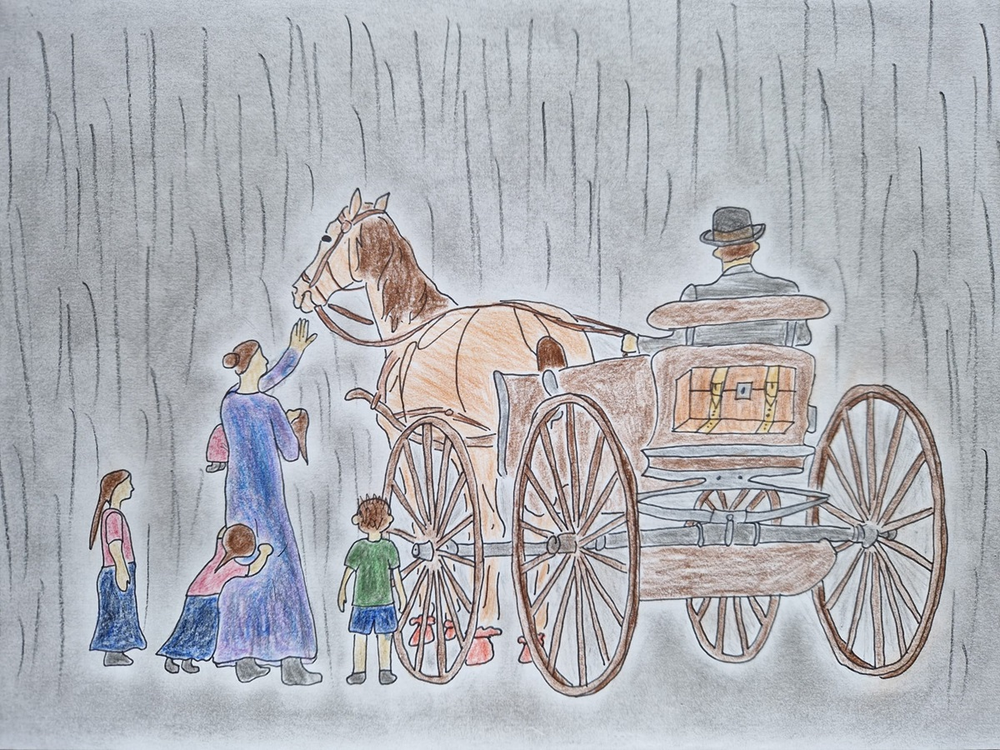

+++
title = "Wenn Grenzen überschritten werden: Flucht in die Freiheit"
date = "2024-10-02"
draft = false
pinned = false
tags = ["DDR", "Familiengeschichte", "Flucht", "Reportage", "Freiheit", "Diktatur", "Geschichte"]
+++

Es ist ein warmer Spätsommerabend 1957, ein wohliges Gefühl breitet sich aus. Die letzte Ernte ist eingefahren, die Arbeit getan. Doch dunkle Wolken der Bedrohung ziehen auf, Familie xy muss eine gravierende Entscheidung treffen. Sie wagt die Flucht, verlässt die DDR. Diese Reportage begibt sich auf die Spuren der Familie xy und anderen Schicksalen und beleuchtet Beweggründe, Ängste und Stärkung der Menschen in dieser Zeit. Und was geht uns dieses Thema in der heutigen Zeit überhaupt an?


Regen prasselt auf die Pflastersteine vor dem Hof der Familie xy mit der Hausnummer neun in Kössuln, DDR (Deutsche Demokratische Republik). Es ist zweiundzwanzig Uhr und rabenschwarze Nacht. In der Luft liegt Anspannung, niemand sagt ein Wort. Nur die Regentropfen hört man auf dem Boden aufklatschen, und jetzt auch die Plane rascheln, womit die Mutter Alice und Christa, Otto, Alice und Ruth zugedeckt werden. Sie sitzen bereits auf dem Breschwagen, der sie gleich zum Taxi bringen soll. Herbert bindet dem Pferd Susi Lappen unter die Hufe, niemand soll sie hören. Die Nacht wirkt gespenstisch und ängstlich schmiegen sich die vier Kinder an ihre Mutter Alice. Dunkelheit, wohin das Auge schaut; Strassenlampen gibt es keine. Es ist, als ob alle die Luft anhalten würden, als der Wagen losrollt. Wilfried öffnet das zweiflügelige Hoftor, ein Quietschen ertönt. Knarzend erträgt die Kutsche das Gewicht des Vaters Herbert, der soeben auf die Kutsche steigt. Susi setzt sich in Bewegung, dumpfes Hufgeklapper ertönt. «Mein Kind, mein Kind!», verzweifelt versucht Oma Zellmann, den Regen zu übertönen, was ihr jedoch nicht gelingt. Susi läuft in einem konstanten Tempo immer weiter und weiter, es riecht nach Regen, nassem Holz und feuchten Kleidern. An der Schule vorbei, rechts abbiegen, bei Richter Säckchen über das Stoppelfeld, fort ins Dunkel. So entschwindet die Familie den Blicken Wilfrieds, der zu diesem Zeitpunkt zwanzigjährig ist. Dieser bleibt nämlich auf dem Hof, damit sein sechzehnjähriger Bruder Herbert, der etwa hundertfünfzig Kilometer weit weg in einer Lehre ist, nicht allein zurückbleibt. Wilfried wagt sich noch einmal in die dunkle Nacht hinaus, er soll Pferd und Kutsche wieder nach Hause holen. Querfeldein kämpft er sich durch den Regen, läuft durch die Kirschbaumallee und kann endlich Susi erkennen, welche mit gebeugtem Kopf den Regen über sich ergehen lässt und an einem Baum angebunden auf ihn wartet. Kalt läuft es Wilfried über den Rücken, er realisiert, dass er nun ganz allein ist, seine Familie ist weg. Ob er sie jemals wiedersehen wird? Kurzerhand sitzt Wilfried auf, Susis Körper hat eine wohltuende Wärme. Gemeinsam traben sie nach Hause. Dort angekommen, versorgt Wilfried Susi und wirft sich ins Bett, so wie er ist, nur die Schuhe zieht er aus. Sofort übermannt ihn der Schlaf.

Das Leben dieser Familie ist von einem Tag auf den anderen auf den Kopf gestellt, verursacht durch die Regierung der DDR. Nicht nur der Familie meines Grossvaters legt sie Steine in den Weg, auch vielen anderen Familien und Personen. Vor allem denen, die sich nicht ohne Probleme in das vorherrschende System einordnen können. Die Menschen haben Versorgungs- und Wohnungsprobleme. Ausserdem müssen sie auf Dinge, wie etwa Bananen, verzichten, da die DDR wenig Handelsbeziehungen hat und deshalb wenig importieren kann. Wahlbetrüge sind nachweisbar, der Staatssicherheitsdienst überschreitet Grenzen. Die Möglichkeit, dass der eigene Nachbar auch zur Stasi gehört, existiert und verunsichert. So kommt auch die Familie in Bedrängnis. So stark, dass sie beschliesst, zu flüchten, was starke psychische und physische Strapazen bedeutet. Das geschriebene Heft Wilfrieds  erzählt über eben jene Strapazen. Ausserdem hatte ich die Ehre, mit Alice zu telefonieren und auf diese Weise spannende Details zu erfahren. Darüber hinaus konnte ich auch mit dem Experten zum Thema «DDR», Jens Gieseke, reden, was mir Aufschluss über Vieles gab. Ferner greife ich zurück auf zwei weitere Fluchtgeschichten. Zum einen auf die fiktive, jedoch auf wahren Begebenheiten beruhende Fluchtgeschichte aus dem Jugendroman «Jenseits der blauen Grenze» (2014), geschrieben von Dorit Linke, zum anderen auf die wahre Fluchtgeschichte der beiden Familien Strelzyk und Wetzel, eindrücklich in Szene gesetzt von dem Regisseur Michael Bully Herbig im Film und Thriller «Ballon» (2018). 

## Die DDR

Auf dem Bildschirm erscheint ein Mann, um die fünfzig herum und mit einem warmen Lächeln auf den Lippen. Im Hintergrund ist ein Bücherregal zu sehen, auf dem sich eine Menge von Büchern befindet. Der Mann selbst, sein Name ist Jens Gieseke, trägt ein weisses Leinenhemd und eine Brille. Ein kurzer Blick auf seine Hand zeigt einen Ring am Ringfinger, am Handgelenk trägt er eine silberne Uhr. Wenn Gieseke lächelt, kann man eine Zahnlücke zwischen seinen Vorderzähnen erkennen. Ein leichter Stoppelbart schmückt sein Gesicht, seine Haare sind blond. Doktor Jens Gieseke macht einen reflektierten und überlegten Eindruck, er erweckt den Eindruck, als dass er viel weiss und ihm selten Fehler passieren. Der Experte arbeitet am Leibniz Zentrum für zeithistorische Forschung (ZZF), wobei er die Schwerpunkte DDR-Geschichte und die Geschichte ab 1990 hat. 1964 wird Gieseke geboren und weiss schon bald, dass er sich mit der DDR befassen möchte. Für ihn ist der Osten eine unbekannte Welt, etwas Mysteriöses. Nachdem er also in Hannover Geschichte studiert, arbeitet er eine Zeit lang bei der Stasiunterlagenbehörde in der Forschungsabteilung und schreibt später sein eigenes Buch zur Geschichte der Stasi. Seit 2008 ist Jens Gieseke nun am ZZF und befasst sich mit dem weiten Bereich der Gesellschaftsgeschichte der DDR. Gänsehaut hat er mittlerweile nicht mehr, wenn er an die DDR denkt, ist aber heute noch fasziniert davon. Gegründet wird die DDR im Jahr 1949 und endet im Jahr 1989 mit dem Mauerfall und der 1990 folgenden «Wiedervereinigung». Betroffen ist der Osten Deutschlands, der nach dem zweiten Weltkrieg von der kommunistischen Sowjetunion verwaltet wird. Zunächst wird Deutschland nach dem Krieg von den vier alliierten Siegermächten übernommen. Das sind die USA, Frankreich, Grossbritannien und die UdSSR . Die Hauptstadt Berlin soll gemeinsam verwaltet werden. Doch schon bald stellt sich heraus, dass die UdSSR andere politische Vorstellungen hat als die anderen Siegermächte, deshalb zieht sich die UdSSR aus dem Verwaltungsgremium zurück. Deshalb vereinigen die USA und Grossbritannien ihre Besatzungszonen zu einem einheitlichen Wirtschaftsgebiet und streben auch die politische Vereinigung an. Später kommt auch die französische Besatzungszone dazu. So wird im Mai 1949 die BRD (Bundesrepublik Deutschland) gegründet, im November 1949 die DDR als Reaktion darauf. Bis 1971 wird der Staat von Walter Ulbricht regiert. Er ist «spitzbärtiger Sachse, \[…] mit einer unangenehmen Fistelstimme: \[…] ein Mann mit einem phänomenalen Namensgedächtnis, erschreckendem Arbeitseifer, begnadetem Organisationstalent – und überlebenswichtigem Machtinstinkt». Wegen zunehmenden Versorgungsengpässen wird die Bevölkerung immer unzufriedener, so übernimmt der gelernte Dachdecker Erich Honecker von 1971 bis 1989 die Macht. Er führt anfangs eine liberale Kulturpolitik und ist für Einheit von Wirtschafts- und Sozialpolitik. Obwohl die DDR «demokratisch» in ihrem Namen hat, ist dies in der Umsetzung des Systems nicht erkennbar. So gibt es zwar fünf Parteien, wovon jedoch lediglich eine Partei, die kommunistische SED , regieren kann. Sie bestimmt die politischen Verhältnisse in enger Verbindung mit der sowjetischen Seite. Die SED lässt sich jedoch nie wählen, sondern stellt das Volk vor die vollendete Tatsache, dass sie die führende Partei ist. Das macht die DDR zu einer kommunistischen Parteidiktatur. Das politische System beeinflusst auch den Alltag der DDR-Bürger. Sie müssen auf gewisse Konsumgüter verzichten, die es im Osten aufgrund komplizierter Handlungsbeziehungen nicht gibt. Die begehrten Artikel gibt es nicht für Ostmark, sondern nur gegen Devisen. Aber nicht nur der Konsum, sondern auch die Freizeit wird von der Regierung beeinflusst. Der Sport ist wichtig, weil er es der DDR ermöglicht, sich international einen Namen zu machen. Aus diesem Grund wird schon früh eine systematische Talentsuche betrieben. Ferienreisen sind möglich, jedoch nur in den sozialistischen Nachbarländern oder innerhalb der DDR. Ausserdem gibt es Freizeitorganisationen für jede Altersgruppe, für die Pioniere  gibt es Freizeitparks. Es gibt Massenorganisationen wie beispielsweise die FDJ  oder den FDGB . Von Kindesbeinen an prägt die SED die Menschen; der Kindergarten steht unter dem Einfluss der Partei, ab der ersten Klasse tritt man den Jungpionieren bei. Ab dem zehnten Lebensjahr kommt man zu den Thälmann-Pionieren, mit vierzehn Jahren zur FDJ. Anschliessend üben die Männer den Wehrdienst aus, während die Frauen vormilitärisch ausgebildet werden. Dann folgt der Eintritt in die Partei und für Berufstätige gibt es die Einheitsgewerkschaft und den Kulturbund. Möchte man sich dem System entziehen, so werden Studiengänge oder gewisse Arbeitspositionen untersagt. Dafür können sich alle Familien die Schule leisten, 1957 wird nämlich das Schulgeld für den Besuch von Mittel- und Oberschulen abgeschafft. Auch werden die Familien finanziell unterstützt, denn sie sind erwünscht: Bei jeder Geburt werden tausend Mark gezahlt, bei der Wohnungssuche werden sie bevorzugt, ausserdem bekommen sie zinslosen Familienkredit in der Höhe von fünftausend Mark. Auch im Bereich «Wohnen» soll Gleichberechtigung herrschen, die Regierung beschlagnahmt Wohnraum, wo es mehr von ihm gibt als pro Person zugedacht. So gibt es gegen 1960 kaum noch private Bauernhöfe. Im Alltag müssen die DDR-Bürger andauernd damit rechnen, dass ihre Aussagen direkt zur Stasi gelangen und sie dafür verhaftet werden. Flüchten wird immer schwieriger, 1961 wird die bekannte Berliner Mauer gebaut. Diese fällt erst nach 28 Jahren, im Jahr 1989 und die DDR wird als Folge aufgelöst. Dies geschieht durch die sogenannten Montagsdemonstrationen, wegen der anhaltenden Massenproteste wird Erich Honecker Ende Oktober von Egon Krenz abgelöst, wenig später tritt das ganze Politbüro zurück. Am 9.11.1989 werden die Grenzen geöffnet. Sowohl für die DDR-Bürger als auch für die BRD-Bürger kommt der Mauerfall unverhofft. Die ostdeutsche Autorin Dorit Linke  erzählt: «Empfunden habe ich im ersten Moment nichts, meine Gefühlslage war eine Mischung aus Ungläubigkeit und Schock», auch Experte Jens Gieseke meint: «Ende Oktober 1989 habe ich einen Text darüber, was als nächstes zu erwarten ist, geschrieben. Da habe ich viele Dinge aufgeschrieben, die dann tatsächlich passiert sind, zum Beispiel, dass sich ein runder Tisch gebildet hat und sozusagen die Oppositionsgruppen legalisiert wurden, aber dass von einem Tag auf den nächsten die Mauern fallen würden, war trotzdem auch für mich eine Überraschung».

## Alice

Das Telefon klingelt. Alice meldet sich. Nachdem sie sich nach meinem Ergehen erkundigt hat, erzählt sie mir, wie sie gemütlich eingemummelt in einer Decke auf dem Sofa ganz in der Nähe des knisternden Kamins sitzt. In der Hand hält sie einen heissen, dampfenden Tee und versucht damit die klirrende Kälte zu verscheuchen. Alice wohnt nämlich in Neuseeland, wo gerade Winter herrscht, die Verhältnisse sind einfach. Bevor Alice die Interviewfragen beantwortet, möchte sie mir gerne noch einige Sachen vorab sagen. Vor allem ein Zitat ist ihr dabei wichtig, welches sie auch gerne langsam und deutlich wiederholt, damit ich es notieren kann. Dieses ist von Jim Elliot und lautet: «Der ist kein Narr, der hergibt, was er nicht behalten kann, um zu gewinnen, was er nicht verlieren kann».  Dieses Zitat spricht vor allem gläubige Menschen an und will ihnen Mut machen, den Blick auf das für sie Wesentliche zu richten, was in diesem Kontext das ewige Leben wäre. Durchaus ist Alice und war auch Wilfried gläubig, weshalb dieses Zitat sehr wertvoll für sie ist und war. Herbert und Alice hatten sechs Kinder. Der Älteste war Wilfried, zum Zeitpunkt der Flucht zwanzig Jahre alt. Dann kam Herbert mit sechzehn Jahren, nach ihm Christa mit zwölf Jahren, dann Otto mit neun Jahren, anschliessend Alice mit fünf Jahren und schliesslich Ruth mit zwei Jahren zum Fluchtzeitpunkt. Alice wird 1952 in Ostdeutschland geboren und muss im Alter von drei Jahren die Mandeln operieren lassen. Krankenhäuser von damals könne man nicht mit denen von heute vergleichen, sie darf keinen Besuch empfangen und ist damit lange von ihrer Familie getrennt. Während ihres Krankenhausaufenthaltes finden die Ärzte heraus, dass mit ihrem Herzen «allerlei nicht stimmt» . Später wird Alice Mutter, sogar dreizehnfache, trotz ihres Herzfehlers. Schon hier zeigt sich ihre klare, unverwechselbare Haltung, als sie nämlich mit dem ersten Kind schwanger ist, empfiehlt ihr der Arzt nachdrücklich, abzutreiben, worauf sie jedoch nur eine Antwort hat: «Oh nein! Das ist nicht richtig in Gottes Augen». Auch gegen die Empfehlung des Arztes, neun Monate zu liegen, sträubt sie sich und weigert sich auch, die verschriebenen Tabletten einzunehmen. Trotzdem werden sie und ihr Mann entgegen aller Erwartungen glückliche Eltern eines gesunden Kindes. Von da an besitzt Alice einen Übernamen; nämlich «Alice aus dem Wunderland». Nun können wir aber mit dem Interview beginnen und erfahren, wie und warum meine Vorfahren das «Fähnchen nicht nach dem Wind gerichtet haben». Ich höre ein Papier rascheln und schon wird die erste Frage vorgelesen, Alice hat sich wohl gut vorbereitet, sie erhielt die Interviewfragen bereits schriftlich im Voraus für ein besseres Verständnis als über das Telefon. Sie erzählt mit Nachdruck, was sie vor ihrem inneren Auge sieht, wenn sie an die DDR zurückdenkt. «Ich sehe die Mauer, ich sehe den Wahnsinn, ich sehe Deutsche, wie sie Deutsche erschiessen müssen». Auf die Frage, ob sie noch einen DDR-Witz kenne, antwortet sie ganz klar ablehnend, sie halte nichts von Witzen, lachen sei aber dennoch gesund. Auch hier zeigt sich wieder Alices klare Haltung, genau wie sie auch mein Grossvater und meine Urgrosseltern hatten, ein Markenzeichen der Familie. Aber eben solche Menschen, die genau wissen, was sie wollen und was nicht, waren von der DDR nicht gerne gesehen. Alice erzählt und erzählt, viel mehr als die Fragen verlangen. Auf einmal sind wir bei der Liebesgeschichte ihrer Eltern angekommen. Langweilig wird es aber nie, denn Alice ist äusserst begabt im Erzählen, genauso wie es Wilfried auch war. 

## Fluchtgeschichten

Naumburg, Juli 1950. Mehrere Stände mit Bildern von den jeweiligen Betrieben, schön hergerichtetes Getreide in Blumenkästen, ausgestellte Kleesorten. Das Wetter ist wohlig warm, die Sonne versteckt sich nicht. Eine landwirtschaftliche Leistungsschau findet statt, Herbert nimmt teil, sein Betrieb wird als der Beste von fünf Landeskreisen ermittelt. Der grösste Stand geht somit an den Betrieb der Familie. Jeder Stand soll einen Spruch aufhängen, beispielsweise «Vorwärts mit dem Sozialismus» oder «Ohne Gott und Sonnenschein fahren wir die Ernte ein». Der Spruch des Standes der Familie sollte «An Gottes Segen ist alles gelegen» lauten, dies wurde jedoch von der Behörde abgelehnt und stattdessen «Ohne Fleiss, kein Preis» vorgeschlagen. Doch Herbert behält seine klare Haltung und besteht auf seinen Spruch, was zu dem Endresultat führt, dass der Stand sich nun ohne Spruch behaupten muss. Dies gelingt gut, Herbert erhält den ersten Preis. Damit wird er noch deutlicher zum Ärgernis der Behörden, sie beginnen nun, auf die Familie und ihren Betrieb aufmerksam zu werden, und das in keiner positiven Weise. Ihrer Meinung nach «muss diese Säule fallen». Der Familienvater lässt sich dadurch nicht beirren, spricht auf öffentlichen Versammlungen und nennt Unrecht beim Namen. Die Zeitung bringt kritische Artikel über ihn, die Repressalien nehmen zu. Wohnraum soll beschlagnahmt werden, obwohl sich in dem alten Bauernhaus nicht so einfach eine Wohnung abtrennen lässt. Verbote werden verhängt, ein Fall kommt vor Gericht. Anwälte, die die Familie verteidigen würden, findet man nicht mehr. Als Wahlen sind und der Familienvater sich weigert, wählen zu gehen, wird er abgeholt. «Eins, zwei, drei, …, zwölf Mann und ihr schämt euch nicht», Herbert hat keine Mühe damit, zu äussern, was er denkt. 
Als am 9. August 1957 etwa fünf Männer zur konkreten Wahl, welche Zimmer des Hauses beschlagnahmt werden, anrücken, hat Herbert gerade die letzte Fuhre der Ernte eingefahren. Eine heftige Diskussion entsteht, Satz auf Satz folgt. Schliesslich sagen die Männer der Behörde: «Sie sind morgen früh acht Uhr auf dem Bürgermeisteramt, oder wir holen Sie!». Der Bauer antwortet darauf, dass er nur komme, wenn er eine schriftliche Vorladung mit dem Grund für die Vorladung erhalte. Empört über Herberts Mut erwidern die Behörden, dass er diese nicht bekomme. Die Diskussion gewinnt an Lautstärke und Erregung, bis die Männer schliesslich gehen. Der Familienvater steht ratlos da und beschliesst, sich bei Pfarrer Barthold Rat zu holen. Dieser rät ihm dringend, einen Fluchtversuch über Berlin zu wagen, da Herbert sonst am nächsten Morgen spurlos verschwände. So entscheidet sich die Familie zur Flucht. Um sechs Uhr abends waren alle noch ahnungslos, wussten nicht, dass sie um zehn Uhr abends alles verlassen würden. 


#### Warum flieht nicht die ganze Familie?

Herberts Familie war schliesslich nicht in Gefahr. Dies hat den Hintergrund, dass Herbert schon an vorderster Front im zweiten Weltkrieg gewesen war, er war Minenleger und -sucher, seine Truppe hatte den Übernamen «Himmelfahrtskommando». Aber er überlebte und kehrte einige Zeit nach dem Kriegsende nach Hause zurück, wie er es bereits gewusst hatte, als er loszog. Die Tränen seiner Frau Alice unter dem Kirschbaum vor dem Haus sind unzählbar, sie hat in dieser Zeit Ungewissheit und Trennung ertragen müssen. Laut Mutter Alice war die Flucht aus der DDR nichts gegen die Kriegsjahre. So sagte Mutter Alice, als das Thema Flucht aufkam: «Wir trennen uns nie mehr freiwillig, ich gehe mit. Wenn du allein gehst, sehen wir uns nie wieder». Und mit ihr kamen dann auch die vier kleinen Kinder mit. 

Familie lässt zwei Kinder und drei Häuser zurück, ordnet keine Akten mehr, plant nichts, nimmt nur das Geld aus dem Schreibtisch mit, packt noch kurz die Windeln ein und fährt in der Nacht mit der Kutsche zum nächsten Taxi, und damit weiter zu Familie Kuckuck; Verwandte von Bekannten, welche einen Wartburg  besitzen. Mit diesem wird Familie von Naumburg bis nach Berlin gebracht. Dort ist sie ratlos, welchen Zug sie nehmen soll. Es ist Mitternacht und die Familie steht verloren und unsicher da. Grenzpolizisten schauen misstrauisch herüber, der Familie wird unwohl. Plötzlich, mitten in der Nacht, steht eine Frau mit Holzbein da, schubst Familie in einen Zug und flüstert ihnen zu, dass sie für sie bete. Etwas verwirrt aber doch mit einem guten Gefühl sitzen die sechs im Zug, doch für Erleichterung ist es noch zu früh. An welcher Station müssen sie aussteigen? Der Zug fährt im Kreis; von Ost nach West und von West nach Ost. Steigt die Familie an der falschen Station aus, so bedeutet das den sicheren Tod für Herbert. Auch im Zug befinden sich Grenzpolizisten, welche die Familie kritisch beäugen, welche Familie fährt schon mitten in der Nacht spazieren. Die Situation wird immer brenzliger, Eltern und Kinder müssen aussteigen. Haben sie es geschafft? Sind sie schon in Westberlin? Schilder verraten es ihnen; sie haben ihr Ziel erreicht. Heisse Tränen der Erleichterung fliessen. 
In Berlin kommt Familie in ein Flüchtlingslager. Vom Flüchtlingslager aus muss sich Familie trennen, sie werden über Verwandte in unterschiedlichen Familien untergebracht, nur Mutter Alice, Christa und die vierjährige Alice dürfen beieinanderbleiben. Von dort aus bauen sie selbst von Hand über mehrere Jahre ein neues Haus auf und beginnen ein neues Leben.
Zurück im August 1957. Der zwanzigjährige Wilfried bleibt in der DDR, damit der sechzehnjährige Herbert, der momentan auswärts seine Lehre absolviert, nicht allein bleibt. Ausserdem kümmert er sich um den Hof, bekommt die Vollmacht dafür und kauft sich ein Motorrad. Für ihn stehen in der DDR alle Wege für die Zukunft offen. Sein Bruder Herbert möchte jedoch, als er von der Flucht seiner Familie erfährt, sofort wieder zu seinen Eltern. Zunächst findet sich ein Pächter für den Hof, da die beiden jungen Männer den einen Aufgaben nicht gewachsen sind, die anderen nicht erledigen wollen. Die beiden Brüder ziehen nun in getrennte Orte und erledigen dort ihre Aufgaben. Schliesslich entscheiden auch sie sich nur wenige Monate später zur Flucht und werden gleich wie ihre Familie von der Familie Kuckuck nach Berlin gebracht. Von dort aus nehmen auch sie den Zug und haben nur eine Aktentasche für beide dabei, damit sie nicht auffallen. Reibungslos kommen sie im westberliner Flüchtlingslager an, werden dort aber getrennt. Das ist vor allem sehr schwer für Herbert, er weint viel. Wilfried wird schon bald ausgeflogen und kommt dann mit Zug und Bus über Sankt Bostel bei Hamburg und Waldbröl bei seinen Eltern in Drinsahl an. Diese haben inzwischen eine Wohnung, die bereits vollständig eingerichtet ist, sogar eine Kuh besitzt die Familie. Pünktlich an Heiligabend 1957 kommt auch Herbert bei seiner Familie an, sitzend auf dem Holzstapel vor dem Haus wird er aufgefunden. Die Freude der Familienmitglieder, wieder als Familie komplett zu sein, nachdem man nicht wusste, ob man sich jemals wiedersehen würde, ist unbeschreiblich.
Etwas anders verläuft die Flucht, die im Film «Ballon» dargestellt wird. Sie passiert im Jahr 1979. Familie Strelzyk und Familie Wetzel wollen aufgrund Problemen mit dem System gemeinsam flüchten, dazu das Element Luft benutzen und in Thüringen starten. Sie bauen und nähen sich selbst einen Heissluftballon, wobei sie aufpassen müssen, dass sie nicht entdeckt werden. Der erste Fluchtversuch, bei dem sich Familie Wetzel zurückzieht, scheitert weil Heizleitungen zufrieren. So sinkt der Ballon zu früh; nämlich auf DDR-Boden. Die Stasi kommt der Familie auf die Spur, mit Hochleistung konstruieren die beiden Familien einen neuen Heissluftballon, Familie Wetzel ist wieder dabei. Als sie den zweiten Versuch wagen, entkommen sie der Stasi nur knapp. Während dem Flug bemerken sie, dass ihnen das Gas ausgeht, und sie landen in einem Wald. Von einer Streifenpolizei erfahren sie, dass sie sich im Westen befinden, die Freude ist gross. 
Eine weitere Fluchtgeschichte ist im Jugendroman «Jenseits der blauen Grenze» beschrieben. Die Flucht verläuft über Wasser; nämlich die Ostsee. 1989 versuchen die beiden Jugendlichen Hanna und Andreas über die Ostsee von Rostock nach Fehmarn zu gelangen. Immer wieder werden Rückblenden eingefügt; Hanna und Andreas kamen in der DDR nicht zurecht, ihre Zukunft hätte alles andere als rosig ausgesehen. Die beiden haben nicht viel Proviant dabei und kämpfen gegen Müdigkeit und Schmerzen. Hanna war in der DDR Leistungsschwimmerin und ist damit im Vorteil gegenüber Andreas, der nicht trainiert hat. Nur eine dünne Schnur verbindet die beiden, damit die Wellen sie nicht auseinanderbringen können. Einmal sind sie nahe an einer Rettung, doch diese Hoffnung schwindet wieder. Andreas merkt, dass er nicht mehr weiterschwimmen kann, Hanna es aber schaffen wird. So trennt er die verbindende Schnur und lässt Hanna weiterschwimmen. Sie nimmt ihre Umgebung nicht mehr wirklich war, schafft es aber irgendwie bis in Landesnähe und wird gerettet. 

## Verschiedene Fluchtzeitpunkte

Welchen Zeitpunkt man zur Flucht wählt, spielt eine grosse Rolle. Die Fluchten sind unterschiedlich riskant, erfordern unterschiedliche Vorbereitung oder Spontaneität. Seit der Gründung der DDR um 1949 bis 1952 sind die Grenzen kaum bewacht, es existiert noch keine Mauer. An manchen Orten trennt nur ein kleines Rinnsal die beiden verschiedenen Welten. Für DDR-Bürger ist hier die Freiheit nur einen Sprung entfernt. Ab 1952 werden Stacheldrahtzäune gebaut, Grenzpolizisten bewachen die Grenze. Es ist, ausser in Berlin, nahezu unmöglich, die Grenze noch zu überwinden. «Berlin ist Anfang der 1960er Jahre das letzte Schlupfloch im Eisernen Vorhang ».  Man kann hier die Grenze noch grösstenteils unbemerkt passieren. Viele Ostberliner arbeiten oder studieren in Westberlin, manche gehen dort auch ins Kino oder Theater. Westberliner besuchen im Osten ihre Verwandten und Bekannten, kaufen günstige Alltagsprodukte. Ostberliner wiederum kaufen in Westberlin Produkte, die es in der DDR nicht gibt. Auch Familie nutzt diese locker kontrollierten Grenzübergänge 1957 und setzt sich schlichtweg in die S-Bahn. Wilfried und Herbert nehmen nur eine Aktentasche mit, um wie Tagesgäste zu auszusehen. Experte Gieseke sagt dazu: «Da konnte einem nicht viel passieren», es sei eine mehr oder weniger unkomplizierte Fluchtmöglichkeit. Dort werden sie im Flüchtlingslager aufgenommen, bekommen einen bundesdeutschen Pass und werden in die BRD ausgeflogen, wenn sie das wollen. Als Reaktion auf die vielen Fluchten über Berlin baut der Staat der DDR in Berlin eine Mauer und erstellt einen Schussbefehl für jeden, der versucht, die Mauer zu passieren. Wer jetzt flüchten will, muss ein grösseres Risiko auf sich nehmen und mehr planen. Bereits elf Tage nach dem Mauerbau durchdringt ein Schuss die Luft, es gibt ein erstes Opfer nach dem Mauerbau zu beklagen, welches versuchte, über den Humboldthafen zu entkommen. Noch im gleichen Jahr des Mauerbaus werden westberliner Studenten aktiv, sie beginnen, Tunnel zu bauen. Dunkel ist es in diesen Tunnel, sie könnten einstürzen oder entdeckt werden. Bis 1964 sind diese Tunnel dennoch eine simple Fluchtmöglichkeit für Ostberliner, dann wird sie jedoch von der Stasi entdeckt und abgeblockt. Ohne diese Möglichkeit gibt es nur noch Fluchtmöglichkeiten, die äusserst risikoreich sind. Die Flucht des Films «Ballon» geschieht im Jahr 1979. In der Anfangsszene wird eine Jugendweihe  gezeigt. Kindergesang dringt an das Ohr, das Auge sieht dunkle Bilder eines Grenzpolizisten, es ist düster. Abwechslungsweise werden Bilder der singenden Kinder im hellen Raum und den dunklen Szenen am Grenzzaun gezeigt. Der Kontrast brennt sich ein, auf einmal sieht man im Dunkeln eine Person auf den Zaun zu rennen, die Kinder singen weiter. Die Person befindet sich nun in der Sperrzone, ein Hund bellt. Die Grenzpolizisten beginnen zu schiessen, die Person rennt weiter. Dramatische Musik setzt ein, die Person klettert mit Haken den Zaun hoch, nochmal ein Schuss, da liegt sie. Blut läuft aus ihrem Mund, sie atmet schnell und schwer, nun wird wieder die Jugendweihe gezeigt. Dieses kurze, dramatische Bild zeigt, wie unmöglich es ist, um 1979 nur über den Zaun zu klettern, man muss sich Anderes einfallen lassen. Das tun die beiden Familien Strelzyk und Wetzel und bauen sich einen Heissluftballon, um über die Grenze zu fliegen, gehen aber auch damit ein hohes Risiko ein, da sie in der Luft ein leichtes Opfer für Schüsse sind und schnell gesehen werden. Unverändert ist die Situation um 1989, in diesem Jahr spielt die Flucht aus dem Buch «Jenseits der blauen Grenze», auch hier braucht es einen guten Plan, Kreativität, Mut und ein Inkaufnehmen des Risikos. Auch die Strände und das Wasser selbst sind in dieser Zeit ausserordentlich gut bewacht, was eine ausgeklügelte Taktik und Bewusstsein der Situation erfordert.

## Verschiedene Fluchtwege

Die verschiedenen Fluchtzeitpunkte haben also auch zur Wahl anderer Fluchtwege geführt. Trotzdem ist die Entscheidung, welchen Fluchtweg man nimmt, auch stark von persönlichen Präferenzen abhängig, ob man spontan sein kann oder viel planen möchte. Die Flucht der Familie Lorenz erfordert viel Spontaneität, innerhalb von vier Stunden fällt die Entscheidung zur Flucht, hastig packt sie die wichtigsten Dinge ein und macht sich auf den Weg. Hätte sie länger gewartet, wäre der Familienvater am nächsten Morgen spurlos verschwunden. Sie reisen mit Kutsche, Taxi, Wartburg und Zug in das Flüchtlingslager in Westberlin. Da die Flucht 1957 stattfindet, steht noch keine Mauer, die Bewachung der Grenzpolizisten ist noch nicht flächendeckend. Trotzdem besteht das Risiko, aufzufallen und festgenommen zu werden. Vor allem für Herbert Lorenz steht einiges auf dem Spiel; wenn er es nicht schafft, wird er sofort verhaftet, es existieren bereits Akten über ihn. Auch die Eltern aus dem Film «Ballon» wären für mehrere Jahre verhaftet worden, wenn sie die Flucht nicht geschafft hätten, die Kinder wären in ein Heim gekommen. Ausserdem besteht während der Flucht die Gefahr, beschossen zu werden. Im Dokument «Verhinderung von Grenzdurchbrüchen» steht Folgendes: «Zögern Sie nicht mit der Anwendung der Schusswaffe, auch dann nicht, wenn die Grenzdurchbrüche mit Frauen und Kindern erfolgen, was sich die Verräter schon oft zunutze gemacht haben». Bereits durch die Formulierung entsteht eine Abneigung gegen die Flüchtenden und die Hemmung, zu schiessen, sinkt. Aber auch schon vor der Flucht besteht das Risiko, entdeckt zu werden. Die beiden Familien brauchen auffällig viel Stoff, die Nähmaschine im Keller rattert alles andere als leise, der Nachbar, der für die Stasi arbeitet, schläft nicht. Die Kinder, die teilweise im Kindergartenalter sind, erzählen ihr Erleben ungefiltert und mit grossem Vertrauensvorschuss. Ausserdem dürfen die «Verräter» keinen Fehler beim Berechnen der physikalischen Kräfte begehen und müssen auch damit rechnen, vom Boden aus gesehen zu werden. Im Wasser bei der Flucht von Hanna und Andreas aus dem Buch «Jenseits der blauen Grenze» besteht die Gefahr, von Booten entdeckt zu werden. Auch für Flüchtende wie sie gilt der Schussbefehl, es gibt Patrouillen auf und am Wasser, am Strand zirkulieren immer im selben Zeitabstand Scheinwerfer. Sie erleuchten alles, dann wird es wieder finster. Diese Finsternis nutzen Hanna und Andreas aus, um die Flucht zu starten. Aber auch noch, als sie es ins internationale Gewässer schaffen, müssen sie Schiffe befürchten, die ihnen nicht wohlgesonnen sind. Ausserdem haben sie auch noch andere Feinde wie Schmerzen wegen einschneidendem Material, Erschöpfung, Angst, Durst und Unterkühlung. Diese Flucht braucht ebenfalls eine genaue Planung; welches Material braucht man, wie verpflegt man sich, welche Route wählt man, wie orientiert man sich. Dennoch ist die Planung nicht so aufwendig wie die bei der Flucht der beiden Familien Strelzyk und Wetzel, es muss nichts berechnet oder konstruiert werden. Planung erfordern aber seit dem Mauerbau so gut wie alle Fluchten. Experte Jens Gieseke zählt viele Arten von Fluchten auf: Tunnelflucht, eine Fahrt im Kofferraum, ein Ausscheren während der Dienstreise oder Pässe fälschen lassen. Aber egal, für welche Methode man sich entscheidet, man muss es planen. Vor allem mit Fluchthelfern wird die Sache kompliziert, diese nehmen ein hohes Risiko auf sich und verlangen unter Umständen auch einen hohen Preis dafür. Man muss sich den Fluchthelfern restlos ausliefern, ihnen blind vertrauen. Auch Familie Lorenz hat Menschen, die ihnen bei der Flucht helfen. Erst der eigene Sohn, dann der Taxifahrer, weiter Familie Kuckuck und schliesslich die mysteriöse Frau am Bahnhof. Eine Gemeinsamkeit wiederum der drei Fluchten aus Buch, Film und Familiengeschichte ist, dass die Ungewissheit, ob man sich bereits in Sicherheit befindet, einen bedeutenden Einfluss auf die Psyche hat. Die flüchtenden Menschen erleben zunächst eine enorme Anspannung, dann Ungewissheit und anschliessend in diesen drei Fällen eine immense Erleichterung. Alice erzählt, wie Familie Lorenz aus dem Zug steigt und sich angespannt umsieht. Angstschweiss rinnt den Rücken hinunter, Dunkelheit umgibt die sechs Personen. Die Pupillen sind geweitet, Hände zittern, immer hektischer werdendes Umhersehen. Und da, auf einmal verrät ein Schild, dass die Familie in der BRD ist. Tränen fliessen, eine erleichterte Atmosphäre breitet sich aus, es ist wie Aufatmen. Erschöpft setzt sich die Familie auf eine Bank, ist überglücklich. Auch die Familien Strelzyk und Wetzel schauen sich angespannt um, als sie mit ihrem Heissluftballon in einem unbekannten Wald landen. Vorsichtig steigen sie aus, äusserste Anspannung liegt in der Luft. Als zwei bayerische Polizisten ihnen Aufschluss darüber, dass sie sich im Westen befinden, geben, ist die Freude riesig. Sie schreien, hüpfen und umarmen sich und die Polizisten. Hätte Familie Strelzyk eine weitere Enttäuschung aushalten müssen nach dem ersten missglückten Fluchtversuch, wäre das nahezu unmöglich zu verarbeiten gewesen. Etwas abgeschwächt, aber trotzdem vorhanden ist diese Ungewissheit auch bei der Flucht von Hanna und Andreas zu finden. Ihr Ziel ist das internationale Gewässer, um dort von einem Schiff mitgenommen zu werden. Auch Hanna und Andreas wissen nicht genau, ob sie dieses bereits erreicht haben und müssen sich damit mit einer ständigen Ungewissheit abfinden.

## Arten der Verarbeitung

Bei der Flucht gibt es demnach heftige psychische Anspannungen, aber auch wenn man in der DDR lebt, muss man sich mit Einigem abfinden. Experte Jens Gieseke findet aus Sicht der Demokratie klar keine Vorteile am System der DDR, «es gibt aber natürlich andere Facetten an diesem System, wo man sagen kann, dass die DDR auch positive Eigenschaften hatte». Damit meint er zum Beispiel die inexistente Arbeitslosigkeit, obwohl auch diese ihre Schattenseite hat. So werden teilweise die Menschen zum Arbeiten gezwungen, dürfen nicht das tun, was sie wollen, weil sie sich nicht anpassen. Privates Eigentum wird zu staatseigenen Betrieben. Studiengänge werden verwehrt, systemuntreue Jugendliche müssen in den Jugendwerkhof . Ausserdem gibt es in der BRD mehr Konsumgüter als in der DDR, die Technik in der DDR ist rückständiger und die Dinge haben in der DDR eine schlechtere Qualität. Weiter müssen sich die DDR-Bürger damit zurechtfinden, dass sich hinter der Steckdose, im Fuss einer Tischlampe oder im eigenen Radio eine Wanze zum Abhören befinden könnte. Das war bei Rainer Eppelmann (Jg. 1942, Pfarrer und Oppositioneller) der Fall. Er erzählt: «Es war ein Risiko, Freunden – oder Menschen, die man dafür hielt – zu vertrauen. […], hinter jeder Aussage vermutete ich Lüge und Taktik» , so muss man immer auf der Hut sein. 

#### Die Mauer-Krankheit
Vieles, was in der DDR passiert, kann jeden Gesunden psychisch krank machen. Vor allem Klaustrophobie (bekannt als Platzangst) und Paranoia (Verfolgungswahn) sind in dem geschlossenen Überwachungsstaat verbreitet. Bei Therapien können Patienten nie sicher sein, ob abgehört wird, was sie den Psychiatern erzählen. 

Sobald man ein falsches Wort sagt, ein falsches Buch besitzt oder gar die falsche Verwandtschaft hat, ist eine Akte angelegt, was im schlimmsten Fall zur Zerstörung der eigenen Existenz führen kann. Als die Mauer gebaut wird, spielen sich ergreifende Abschiedsszenen ab, die Menschen fürchten, sich nie wieder zu sehen. All diese grossen Belastungen müssen irgendwie verarbeitet werden, die Menschen müssen einen Weg finden, sich mit der Situation zu arrangieren. 

#### Vergleich mit dem Tod
Alice Schenk vergleicht die Verarbeitung der Flucht, des Zurücklassens und Aufgebens mit der Verarbeitung und dem Umgang mit dem Tod. «Man kann das alte Leben nicht zurückholen, die Lücke und der Schmerz sind da». Das Wissen jedoch, dass dieser Weg der Weg Gottes für diese Familie ist, würde helfen, den Verlust zu verarbeiten. 

Herr Gieseke meint dazu, dass man sich entweder im System zurechtfinden oder flüchten muss, ein Zwischending gäbe es nicht. «Es gibt Holz, das man biegen kann. Anderes zerbricht, wenn man es biegen will», ein Satz, der auf die Situation in der DDR zutrifft und der Familie Lorenz auf ihrem Weg begleitet. Herbert Lorenz ist kein Holz, das man biegen kann; er kann sich nicht in das System der DDR einfügen, würde brechen, wenn er bliebe. Andere Menschen lassen sich biegen, für sie ist das Leben in der DDR kein grosses Problem. J.Gieseke findet, dass es bei dem Zurechtfinden im System helfe, wenn man sich auf das konzentriere, was man habe und nicht auf das, was man nicht habe. Damit könne man glücklich werden, man müsse nur die Regeln und Grenzen akzeptieren. Tatsächlich nennt Jens Gieseke auch das Westfernsehen als Verarbeitungsmethode; dort, wo das Westfernsehen nicht zugänglich ist, seien die Ausreiseanteile höher, es sei wohl ein Beruhigungsmittel mit einer Stabilisierungswirkung, einmal eine «perfekte Welt» zu sehen. Aber auch Familie und Freunde trügen dazu bei, dass man sich besser mit der Situation abfinden könne. Auch die bekannten DDR-Witze über Politik und Wirtschaft seien ein Ventil zur Verarbeitung, es sei gewissermassen eine lebendige Witzkultur entstanden, die Witze werden in den letzten zwanzig Jahren der DDR sogar toleriert. Diese Witzkultur fällt in der Geschichte von Hanna und Andreas auf, in dem Jugendroman sind viele DDR-Witze zu finden. Eigentlich tragische Dinge, über die dann gelacht wird. 

#### Ein DDR-Witz
Steht ein DDR-Bürger auf dem Fernsehturm und sieht drei Weltmeere: "Schaue ich vor mir, sehe ich ein Lichtermeer. Schaue ich über mir, sehe ich ein Sternenmeer und schaue ich hinter mir, sehe ich Garnischtmeer".

Auch Familie Strelzyk erzählt während der Flucht einen Witz, um die Stimmung aufzulockern. Zwar findet Gieseke diese Witze nicht besonders originell, sie hätten immer dasselbe Thema, trotzdem sieht er in ihnen eine funktionierende Verarbeitungsmethode. Auch Simon Wiesenthal, österreichisch-jüdischer Architekt und Schriftsteller, hat eine ähnliche Haltung zur Verarbeitung mithilfe von Witzen. In seinem Buch «Recht, nicht Rache» schreibt er: «Witz ist in meinen Augen eine der besten Brücken, die man zum Gegner bauen kann. Jeder gute Witz enthält ein mehr oder minder grosses Quantum an Aggression, das man auf diese Weise loswird, so dass man nachher um so gelassener sprechen kann. Und nichts befreit so sehr wie lachen» (S.424). Witze hälfen auch dabei, den Gegner nicht mehr umbringen zu wollen und man könne sie ganz bewusst als Waffe gebrauchen. Wenn man also in der Lage ist, Witze zu reissen, ist dies eine gute Weise, mit den Einschränkungen zurechtzukommen. 